# 🏗️ Healthcare Symptom Checker - Complete Architecture Diagram

## System Architecture Overview

## RAG Implementation Flow

```mermaid
graph LR
    subgraph "Knowledge Ingestion"
        A[📄 Medical Literature<br/>Research Papers<br/>Clinical Guidelines]
        B[🔍 Data Processing<br/>Text Extraction<br/>Chunking Strategy]
        C[🧮 Embedding Generation<br/>Jina AI Medical Models<br/>Vector Creation]
    end
    
    subgraph "Vector Storage"
        D[🗄️ ChromaDB<br/>Vector Database<br/>Similarity Search]
        E[📊 Metadata Indexing<br/>Condition Mapping<br/>Source Attribution]
    end
    
    subgraph "Retrieval Process"
        F[🔍 Query Processing<br/>Symptom Analysis<br/>Context Extraction]
        G[📈 Similarity Search<br/>Vector Matching<br/>Relevance Scoring]
        H[📋 Result Ranking<br/>Confidence Scoring<br/>Source Validation]
    end
    
    subgraph "Generation Process"
        I[🧠 LLM Integration<br/>Gemini Pro<br/>Medical Reasoning]
        J[📝 Response Synthesis<br/>Evidence Integration<br/>Citation Generation]
        K[✅ Quality Assurance<br/>Medical Validation<br/>Safety Checks]
    end
    
    A --> B
    B --> C
    C --> D
    D --> E
    
    F --> G
    G --> H
    H --> I
    
    D --> G
    E --> H
    
    I --> J
    J --> K
```

## Data Flow Sequence

```mermaid
sequenceDiagram
    participant User
    participant Frontend
    participant API
    participant Auth
    participant Triage
    participant RAG
    participant LLM
    participant DB
    participant Cache
    
    User->>Frontend: Describe symptoms
    Frontend->>API: POST /api/symptom/message
    
    API->>Auth: Validate session
    Auth-->>API: Session valid
    
    API->>Triage: Check for emergencies
    Triage-->>API: Emergency status
    
    alt Emergency Detected
        API-->>Frontend: Emergency alert
        Frontend-->>User: 🚨 Call 911 immediately
    else Normal Processing
        API->>RAG: Retrieve relevant conditions
        RAG->>DB: Query vector database
        DB-->>RAG: Medical conditions
        RAG-->>API: Ranked results
        
        API->>LLM: Analyze with context
        LLM-->>API: Assessment + recommendations
        
        API->>DB: Store conversation
        API->>Cache: Update session cache
        API-->>Frontend: Complete assessment
        Frontend-->>User: Results + follow-up questions
    end
```

## Security Architecture

```mermaid
graph TB
    subgraph "Network Security"
        A[🛡️ DDoS Protection<br/>Cloudflare Integration<br/>Rate Limiting]
        B[🔐 SSL/TLS Encryption<br/>End-to-end Security<br/>Certificate Management]
        C[🌐 CORS Configuration<br/>Origin Validation<br/>Header Security]
    end
    
    subgraph "Application Security"
        D[🔑 JWT Authentication<br/>Token-based Auth<br/>Session Management]
        E[🛡️ Input Validation<br/>Pydantic Schemas<br/>SQL Injection Prevention]
        F[📊 Audit Logging<br/>Security Events<br/>Compliance Tracking]
    end
    
    subgraph "Data Security"
        G[🔒 Data Encryption<br/>At-rest & In-transit<br/>Key Management]
        H[🏥 HIPAA Compliance<br/>PHI Protection<br/>Privacy Controls]
        I[🔐 Access Controls<br/>Role-based Permissions<br/>Principle of Least Privilege]
    end
    
    subgraph "Infrastructure Security"
        J[🐳 Container Security<br/>Image Scanning<br/>Runtime Protection]
        K[☸️ Kubernetes Security<br/>Network Policies<br/>Pod Security]
        L[☁️ Cloud Security<br/>IAM Policies<br/>Resource Isolation]
    end
    
    A --> D
    B --> E
    C --> F
    
    D --> G
    E --> H
    F --> I
    
    G --> J
    H --> K
    I --> L
```

## Deployment Architecture

```mermaid
graph TB
    subgraph "Global CDN"
        CDN[☁️ Vercel Edge Network<br/>Global Distribution<br/>Static Asset Delivery]
    end
    
    subgraph "Application Tier"
        LB[⚖️ Load Balancer<br/>Health Checks<br/>SSL Termination]
        APP1[🚀 App Instance 1<br/>FastAPI + Python<br/>Auto-scaling]
        APP2[🚀 App Instance 2<br/>FastAPI + Python<br/>Auto-scaling]
        APP3[🚀 App Instance N<br/>FastAPI + Python<br/>Auto-scaling]
    end
    
    subgraph "Data Tier"
        DB_PRIMARY[(🗄️ PostgreSQL Primary<br/>Write Operations<br/>ACID Compliance)]
        DB_REPLICA[(🗄️ PostgreSQL Replica<br/>Read Operations<br/>Load Distribution)]
        VECTOR_DB[(🔮 ChromaDB<br/>Vector Storage<br/>Similarity Search)]
        CACHE[(⚡ Redis Cluster<br/>Session Storage<br/>Rate Limiting)]
    end
    
    subgraph "External Services"
        GEMINI[🤖 Google Gemini API<br/>Primary LLM<br/>Medical Reasoning]
        GROQ[⚡ Groq API<br/>Backup LLM<br/>Fast Inference]
        JINA[🔗 Jina AI API<br/>Medical Embeddings<br/>Domain Models]
    end
    
    subgraph "Monitoring"
        METRICS[📊 Prometheus<br/>Metrics Collection<br/>Performance Data]
        GRAFANA[📈 Grafana<br/>Visualization<br/>Real-time Dashboards]
        ALERTS[🚨 AlertManager<br/>Incident Response<br/>Notification System]
    end
    
    CDN --> LB
    LB --> APP1
    LB --> APP2
    LB --> APP3
    
    APP1 --> DB_PRIMARY
    APP2 --> DB_PRIMARY
    APP3 --> DB_PRIMARY
    
    APP1 --> DB_REPLICA
    APP2 --> DB_REPLICA
    APP3 --> DB_REPLICA
    
    APP1 --> VECTOR_DB
    APP2 --> VECTOR_DB
    APP3 --> VECTOR_DB
    
    APP1 --> CACHE
    APP2 --> CACHE
    APP3 --> CACHE
    
    APP1 --> GEMINI
    APP2 --> GROQ
    APP3 --> JINA
    
    APP1 --> METRICS
    APP2 --> METRICS
    APP3 --> METRICS
    
    METRICS --> GRAFANA
    METRICS --> ALERTS
```

## Component Architecture

## Frontend Architecture

## Scaling Strategy

```mermaid
graph LR
    subgraph "Horizontal Scaling"
        A[📊 Load Balancer<br/>Traffic Distribution<br/>Health Checks]
        B[🔄 Auto-scaling<br/>Kubernetes HPA<br/>Resource-based Scaling]
        C[📈 Database Scaling<br/>Read Replicas<br/>Connection Pooling]
    end
    
    subgraph "Caching Strategy"
        D[⚡ Redis Cache<br/>Session Storage<br/>Frequent Queries]
        E[🌐 CDN Caching<br/>Static Assets<br/>Global Distribution]
        F[💾 Application Cache<br/>In-memory Storage<br/>Computed Results]
    end
    
    subgraph "Performance Optimization"
        G[🚀 Async Processing<br/>Non-blocking I/O<br/>Concurrent Requests]
        H[📊 Database Optimization<br/>Indexing Strategy<br/>Query Optimization]
        I[🔍 Vector Search<br/>Optimized Embeddings<br/>Efficient Retrieval]
    end
    
    A --> D
    B --> E
    C --> F
    
    D --> G
    E --> H
    F --> I
```

