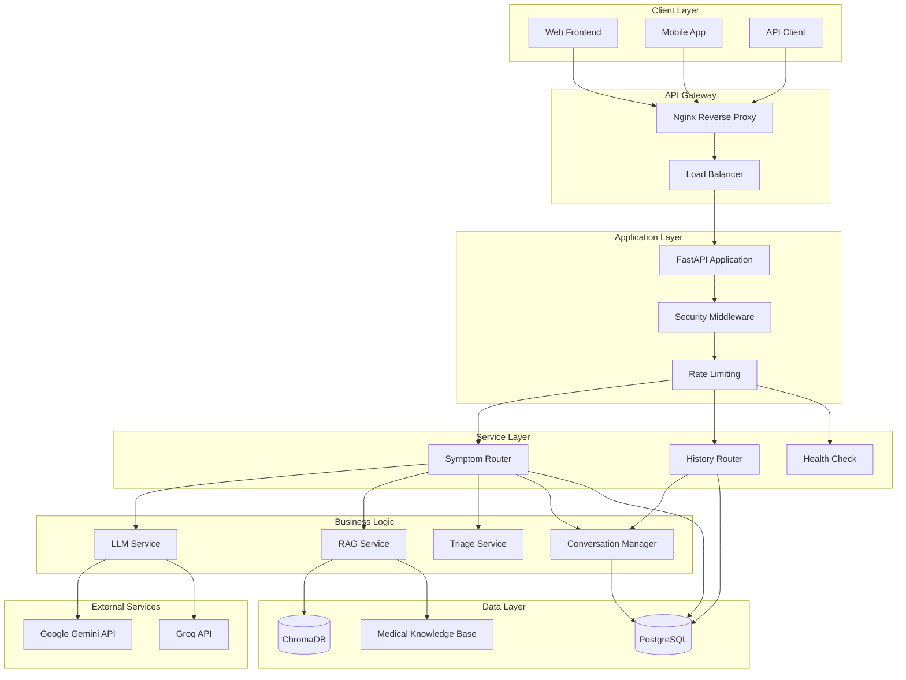
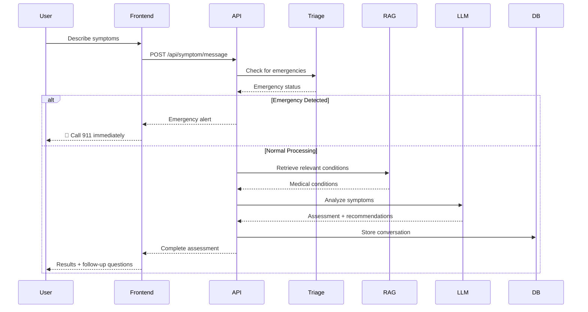
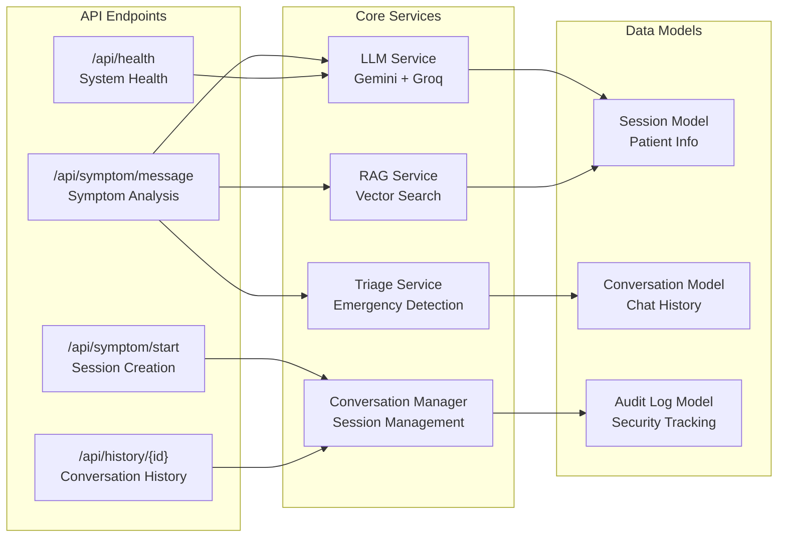
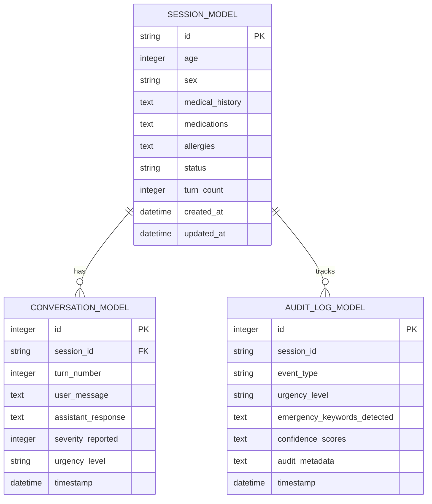

# 🏥 Healthcare Symptom Checker API

<div align="center">


**AI-powered medical symptom analysis with emergency detection and multi-turn conversation support**

[🚀 Quick Start](#-quick-start) • [📖 Documentation](#-documentation) • [🏗️ Architecture](#️-architecture) • [🔧 API Reference](#-api-reference) • [🚀 Deployment](#-deployment)

</div>

---

## 📋 Table of Contents

- [Overview](#-overview)
- [Features](#-features)
- [Architecture](#️-architecture)
- [Quick Start](#-quick-start)
- [API Reference](#-api-reference)
- [Database Schema](#-database-schema)
- [Configuration](#-configuration)
- [Deployment](#-deployment)
- [Development](#-development)
- [Testing](#-testing)
- [Contributing](#-contributing)
- [License](#-license)

---

## 🎯 Overview

The Healthcare Symptom Checker is a production-ready, AI-powered medical symptom analysis system that provides intelligent health assessments with emergency detection capabilities. Built with modern technologies and industry best practices, it offers real-time symptom analysis, multi-turn conversations, and comprehensive medical knowledge integration.

### 🎯 Key Capabilities

- **🧠 AI-Powered Analysis**: Advanced LLM integration with Gemini and Groq
- **🚨 Emergency Detection**: Real-time identification of life-threatening conditions
- **💬 Multi-turn Conversations**: Context-aware symptom discussions
- **📊 Medical Knowledge Base**: Comprehensive condition database with RAG
- **🔗 Jina AI Integration**: High-accuracy medical embeddings for enhanced semantic search
- **🔒 Production Security**: Rate limiting, authentication, and audit logging
- **📈 Scalable Architecture**: Microservices-ready with containerization

---

## ✨ Features

### 🚨 Emergency Detection
- **Real-time Analysis**: Instant detection of emergency keywords and symptoms
- **Severity Assessment**: 1-10 scale with automatic triage recommendations
- **Emergency Alerts**: Immediate warnings with 911 call integration
- **Life-threatening Conditions**: Heart attack, stroke, severe allergic reactions

### 🧠 AI-Powered Analysis
- **Dual LLM Support**: Gemini for reasoning, Groq for speed
- **Context Awareness**: Multi-turn conversation memory
- **Medical Reasoning**: Detailed explanations of assessments
- **Confidence Scoring**: Probability-based condition matching

### 📊 Comprehensive Medical Knowledge
- **775+ Medical Conditions**: Extensive database with symptoms and treatments
- **RAG Integration**: Vector-based similarity search for relevant conditions
- **Jina AI Embeddings**: Specialized medical embeddings for accurate semantic matching
- **Body System Mapping**: Cardiovascular, respiratory, neurological, etc.
- **Treatment Recommendations**: Evidence-based care suggestions

### 🔒 Production Security
- **Rate Limiting**: Configurable request throttling
- **Security Headers**: CORS, XSS protection, content security
- **Audit Logging**: Complete request/response tracking
- **Input Validation**: Comprehensive data sanitization

### 🔗 Jina AI Integration
- **Medical Embeddings**: Specialized healthcare-focused embedding models
- **High Accuracy**: Superior semantic matching for medical terminology
- **API Integration**: Cloud-based embedding service with retry logic
- **Fallback Support**: Graceful degradation when service unavailable

### 📈 Scalability & Performance
- **Async Operations**: Non-blocking I/O with FastAPI
- **Database Pooling**: Optimized PostgreSQL connections
- **Caching**: Vector database with ChromaDB
- **Containerization**: Docker and Docker Compose ready

---

## 🏗️ Architecture

### System Architecture Diagram



### Data Flow Diagram



### Component Architecture



---

## 🚀 Quick Start

### Prerequisites

- **Python 3.11+**
- **PostgreSQL 13+**
- **Docker & Docker Compose** (optional)
- **API Keys**: Gemini and Groq

### 1. Clone Repository

```bash
git clone https://github.com/yourusername/healthcare-symptom-checker.git
cd healthcare-symptom-checker
```

### 2. Environment Setup

```bash
# Create virtual environment
python -m venv venv
source venv/bin/activate  # On Windows: venv\Scripts\activate

# Install dependencies
pip install -r requirements.txt

# Copy environment template
cp .env_example .env

# Edit .env with your API keys
nano .env
```

### 3. Database Setup

```bash
# Start PostgreSQL (using Docker)
docker run --name postgres-healthcare \
  -e POSTGRES_DB=symptom_checker \
  -e POSTGRES_USER=postgres \
  -e POSTGRES_PASSWORD=your_password \
  -p 5432:5432 \
  -d postgres:15

# Or use existing PostgreSQL instance
# Update DATABASE_URL in .env file
```

### 4. Run Application

```bash
# Start the application
python main.py

# Or using uvicorn directly
uvicorn main:app --host 0.0.0.0 --port 8000 --reload
```

### 5. Verify Installation

```bash
# Health check
curl http://localhost:8000/api/health

# Expected response:
{
  "status": "healthy",
  "services": {
    "database": "operational",
    "rag": "operational",
    "llm": "operational"
  }
}
```

### 6. Access Documentation

- **API Docs**: http://localhost:8000/docs
- **ReDoc**: http://localhost:8000/redoc
- **Health Check**: http://localhost:8000/api/health

---

## 🔧 API Reference

### Base URL
```
http://localhost:8000
```

### Authentication
Currently, the API is open for development. Production deployments should implement proper authentication.

### Endpoints

#### 🏥 Health Check
```http
GET /api/health
```

**Response:**
```json
{
  "status": "healthy",
  "services": {
    "database": "operational",
    "rag": "operational",
    "llm": "operational"
  }
}
```

#### 🚀 Start Session
```http
POST /api/symptom/start
```

**Request Body:**
```json
{
  "age": 30,
  "sex": "male",
  "medical_history": ["diabetes", "hypertension"],
  "medications": ["metformin", "lisinopril"],
  "allergies": ["penicillin"]
}
```

**Response:**
```json
{
  "session_id": "uuid-string",
  "message": "Session created successfully. Please describe your symptoms.",
  "created_at": "2024-01-01T12:00:00Z"
}
```

#### 💬 Send Message
```http
POST /api/symptom/message
```

**Request Body:**
```json
{
  "session_id": "uuid-string",
  "message": "I have severe chest pain and can't breathe",
  "severity": 10,
  "duration": "30 minutes"
}
```

**Response:**
```json
{
  "session_id": "uuid-string",
  "assessment": {
    "urgency": "emergency",
    "emergency_warning": "🚨 MEDICAL EMERGENCY DETECTED 🚨",
    "probable_conditions": [
      {
        "name": "Acute Myocardial Infarction",
        "probability": 0.85,
        "description": "Heart attack - blockage of blood flow to heart",
        "urgency_level": "emergency",
        "recommendations": ["Call 911 immediately", "Do not drive yourself"]
      }
    ],
    "clarifying_questions": [],
    "reasoning": "Emergency keywords detected: severe chest pain, can't breathe",
    "recommendations": [
      "Call 911 immediately",
      "Do not drive yourself",
      "Stay calm and wait for emergency services"
    ],
    "body_systems_affected": ["cardiovascular", "respiratory"],
    "disclaimer": "This is a medical emergency. Call 911 now."
  },
  "conversation_turn": 1,
  "timestamp": "2024-01-01T12:00:00Z"
}
```

#### 📊 Get History
```http
GET /api/history/{session_id}
```

**Response:**
```json
{
  "session_id": "uuid-string",
  "turns": [
    {
      "user_message": "I have chest pain",
      "assistant_response": { /* Assessment object */ },
      "timestamp": "2024-01-01T12:00:00Z",
      "severity_reported": 8
    }
  ],
  "total_turns": 1,
  "created_at": "2024-01-01T12:00:00Z",
  "last_updated": "2024-01-01T12:00:00Z",
  "summary": "Session with 1 conversation turns"
}
```

#### 📄 Export Conversation
```http
POST /api/history/export
```

**Request Body:**
```json
{
  "session_id": "uuid-string",
  "format": "json"  // or "text"
}
```

---

## 🗄️ Database Schema

### Entity Relationship Diagram



### Table Definitions

#### Sessions Table
```sql
CREATE TABLE sessions (
    id VARCHAR(36) PRIMARY KEY,
    age INTEGER,
    sex VARCHAR(10),
    medical_history TEXT,  -- JSON array
    medications TEXT,      -- JSON array
    allergies TEXT,        -- JSON array
    status VARCHAR(20) DEFAULT 'active',
    turn_count INTEGER DEFAULT 0,
    created_at TIMESTAMP DEFAULT CURRENT_TIMESTAMP,
    updated_at TIMESTAMP DEFAULT CURRENT_TIMESTAMP
);
```

#### Conversations Table
```sql
CREATE TABLE conversations (
    id SERIAL PRIMARY KEY,
    session_id VARCHAR(36) REFERENCES sessions(id),
    turn_number INTEGER NOT NULL,
    user_message TEXT NOT NULL,
    assistant_response TEXT,  -- JSON object
    severity_reported INTEGER,
    urgency_level VARCHAR(20),
    timestamp TIMESTAMP DEFAULT CURRENT_TIMESTAMP
);
```

#### Audit Logs Table
```sql
CREATE TABLE audit_logs (
    id SERIAL PRIMARY KEY,
    session_id VARCHAR(36),
    event_type VARCHAR(50),
    urgency_level VARCHAR(20),
    emergency_keywords_detected TEXT,  -- JSON array
    confidence_scores TEXT,            -- JSON object
    audit_metadata TEXT,               -- JSON object
    timestamp TIMESTAMP DEFAULT CURRENT_TIMESTAMP
);
```

---

## ⚙️ Configuration

### Environment Variables

| Variable | Description | Default | Required |
|----------|-------------|---------|----------|
| `GEMINI_API_KEY` | Google Gemini API key | - | ✅ |
| `GROQ_API_KEY` | Groq API key | - | ✅ |
| `JINA_API_KEY` | Jina AI API key for embeddings | - | ✅ |
| `DATABASE_URL` | PostgreSQL connection string | - | ✅ |
| `DEBUG` | Enable debug mode | `false` | ❌ |
| `LOG_LEVEL` | Logging level | `INFO` | ❌ |
| `RATE_LIMIT_REQUESTS` | Requests per minute | `50` | ❌ |
| `SESSION_TIMEOUT` | Session timeout (seconds) | `3600` | ❌ |
| `EMERGENCY_DETECTION_THRESHOLD` | Emergency detection threshold | `0.85` | ❌ |

### Configuration Classes

```python
class Settings(BaseSettings):
    # API Keys
    GEMINI_API_KEY: str
    GROQ_API_KEY: str
    JINA_API_KEY: str
    
    # Database
    DATABASE_URL: str
    
    # LLM Configuration
    PRIMARY_LLM: str = "gemini"
    FALLBACK_LLM: str = "groq"
    TEMPERATURE_ANALYSIS: float = 0.3
    
    # RAG Configuration
    CHROMA_PERSIST_DIR: str = "./chroma_db"
    EMBEDDING_MODEL: str = "all-MiniLM-L6-v2"
    KNOWLEDGE_BASE_PATH: str = "./app/data/medical_kb.json"
    MEDICAL_RESEARCH_KB_PATH: str = "./app/data/medical_research_kb.json"
    
    # Security
    RATE_LIMIT_REQUESTS: int = 50
    ALLOWED_ORIGINS: str = "http://localhost:3000"
    
    # Medical Settings
    EMERGENCY_DETECTION_THRESHOLD: float = 0.85
    MAX_CONVERSATION_TURNS: int = 20
```

---

## 🚀 Deployment

### Docker Deployment

#### 1. Build and Run with Docker Compose

```bash
# Clone repository
git clone https://github.com/yourusername/healthcare-symptom-checker.git
cd healthcare-symptom-checker

# Create .env file
cp .env_example .env
# Edit .env with your configuration

# Start services
docker-compose up -d

# Check logs
docker-compose logs -f api
```

#### 2. Docker Compose Configuration

```yaml
version: '3.8'

services:
  api:
    build: .
    ports:
      - "8000:8000"
    environment:
      - DATABASE_URL=postgresql://postgres:password@db:5432/symptom_checker
    depends_on:
      - db
    volumes:
      - ./chroma_db:/app/chroma_db

  db:
    image: postgres:15
    environment:
      - POSTGRES_DB=symptom_checker
      - POSTGRES_USER=postgres
      - POSTGRES_PASSWORD=password
    volumes:
      - postgres_data:/var/lib/postgresql/data
    ports:
      - "5432:5432"

  nginx:
    image: nginx:alpine
    ports:
      - "80:80"
    volumes:
      - ./nginx.conf:/etc/nginx/nginx.conf
    depends_on:
      - api

volumes:
  postgres_data:
```

### Cloud Deployment

#### Render.com

1. **Connect Repository**: Link your GitHub repository
2. **Configure Environment**:
   ```bash
   Build Command: pip install -r requirements.txt
   Start Command: python main.py
   ```
3. **Add Environment Variables**:
   - `GEMINI_API_KEY`
   - `GROQ_API_KEY`
   - `DATABASE_URL`
4. **Deploy**: Automatic deployment on push

#### Railway

1. **Install Railway CLI**:
   ```bash
   npm install -g @railway/cli
   railway login
   ```
2. **Deploy**:
   ```bash
   railway init
   railway up
   ```
3. **Set Variables**:
   ```bash
   railway variables set GEMINI_API_KEY=your_key
   railway variables set GROQ_API_KEY=your_key
   ```

#### AWS/GCP/Azure

Use the provided Docker configuration with your preferred container orchestration service:

- **AWS**: ECS, EKS, or Elastic Beanstalk
- **GCP**: Cloud Run, GKE, or App Engine
- **Azure**: Container Instances, AKS, or App Service

### Production Checklist

- [ ] **Environment Variables**: All secrets configured
- [ ] **Database**: PostgreSQL with proper backups
- [ ] **SSL/TLS**: HTTPS enabled with valid certificates
- [ ] **Monitoring**: Health checks and logging configured
- [ ] **Rate Limiting**: Appropriate limits for your use case
- [ ] **Security Headers**: CORS and security middleware enabled
- [ ] **Backup Strategy**: Database and vector store backups
- [ ] **Scaling**: Load balancer and auto-scaling configured

---

## 🛠️ Development

### Project Structure

```
healthcare-symptom-checker/
├── app/
│   ├── __init__.py
│   ├── main.py                 # FastAPI application
│   ├── config.py              # Configuration settings
│   ├── database.py            # Database connection
│   ├── models.py              # Pydantic & SQLAlchemy models
│   ├── middleware.py          # Custom middleware
│   ├── routers/               # API route handlers
│   │   ├── symptoms.py        # Symptom analysis endpoints
│   │   └── history.py         # Conversation history
│   ├── services/              # Business logic services
│   │   ├── llm_service.py     # LLM integration
│   │   ├── rag_service.py     # RAG implementation
│   │   ├── triage_service.py  # Emergency detection
│   │   └── conversation_manager.py  # Session management
│   ├── utils/                 # Utility functions
│   │   └── prompts.py         # LLM prompts
│   └── data/                  # Data files
│       └── medical_kb.json    # Medical knowledge base
├── tests/                     # Test suite
├── docker-compose.yml         # Docker configuration
├── Dockerfile                 # Container definition
├── requirements.txt           # Python dependencies
├── .env_example              # Environment template
└── README.md                 # This file
```

### Development Setup

```bash
# Install development dependencies
pip install -r requirements.txt
pip install -r requirements-dev.txt

# Run tests
pytest

# Run with hot reload
uvicorn main:app --reload --host 0.0.0.0 --port 8000

# Code formatting
black .
flake8 .

# Type checking
mypy .
```

### Adding New Features

1. **Create Service**: Add business logic in `app/services/`
2. **Define Models**: Update `app/models.py` with new schemas
3. **Add Routes**: Create endpoints in `app/routers/`
4. **Write Tests**: Add test cases in `tests/`
5. **Update Documentation**: Update this README

---

## 🧪 Testing

### Test Structure

```bash
tests/
├── conftest.py           # Test configuration
├── test_api.py          # API endpoint tests
├── test_services.py     # Service layer tests
└── test_basics.py       # Basic functionality tests
```

### Running Tests

```bash
# Run all tests
pytest

# Run with coverage
pytest --cov=app --cov-report=html

# Run specific test file
pytest tests/test_api.py

# Run with verbose output
pytest -v

# Run tests in parallel
pytest -n auto
```

### Test Examples

```python
def test_emergency_detection():
    """Test emergency keyword detection"""
    response = client.post("/api/symptom/message", json={
        "session_id": "test-session",
        "message": "I have severe chest pain",
        "severity": 10
    })
    
    assert response.status_code == 200
    assert response.json()["assessment"]["urgency"] == "emergency"

def test_session_creation():
    """Test session creation"""
    response = client.post("/api/symptom/start", json={
        "age": 30,
        "sex": "male"
    })
    
    assert response.status_code == 200
    assert "session_id" in response.json()
```

---

## 📊 Performance & Monitoring

### Performance Metrics

- **Response Time**: < 2 seconds for symptom analysis
- **Throughput**: 100+ requests per minute
- **Availability**: 99.9% uptime target
- **Error Rate**: < 0.1% error rate

### Monitoring Setup

```python
# Health check endpoint
@app.get("/api/health")
async def health_check():
    return {
        "status": "healthy",
        "services": {
            "database": check_database(),
            "rag": check_rag_service(),
            "llm": check_llm_service()
        },
        "timestamp": datetime.utcnow()
    }
```

### Logging Configuration

```python
# Structured logging
import structlog

logger = structlog.get_logger()

# Log levels
DEBUG: Detailed diagnostic information
INFO: General application flow
WARNING: Something unexpected happened
ERROR: A serious problem occurred
CRITICAL: A very serious error occurred
```

---

## 🔒 Security

### Security Features

- **Rate Limiting**: Prevents abuse and DoS attacks
- **Input Validation**: Comprehensive data sanitization
- **CORS Protection**: Configurable cross-origin policies
- **Security Headers**: XSS, CSRF, and clickjacking protection
- **Audit Logging**: Complete request/response tracking

### Security Best Practices

1. **API Keys**: Store in environment variables, never in code
2. **Database**: Use connection pooling and prepared statements
3. **HTTPS**: Always use SSL/TLS in production
4. **Updates**: Keep dependencies updated
5. **Monitoring**: Monitor for suspicious activity

### Vulnerability Management

```bash
# Check for security vulnerabilities
pip install safety
safety check

# Update dependencies
pip install --upgrade -r requirements.txt
```

---

## 🤝 Contributing

We welcome contributions! Please follow these guidelines:

### Development Workflow

1. **Fork** the repository
2. **Create** a feature branch: `git checkout -b feature/amazing-feature`
3. **Commit** your changes: `git commit -m 'Add amazing feature'`
4. **Push** to the branch: `git push origin feature/amazing-feature`
5. **Open** a Pull Request

### Code Standards

- **Python**: Follow PEP 8 style guide
- **Type Hints**: Use type annotations
- **Documentation**: Update docstrings and README
- **Tests**: Add tests for new features
- **Commits**: Use conventional commit messages

### Pull Request Template

```markdown
## Description
Brief description of changes

## Type of Change
- [ ] Bug fix
- [ ] New feature
- [ ] Breaking change
- [ ] Documentation update

## Testing
- [ ] Tests pass locally
- [ ] New tests added
- [ ] Manual testing completed

## Checklist
- [ ] Code follows style guidelines
- [ ] Self-review completed
- [ ] Documentation updated
```

---

## 🆘 Support

### Getting Help

- **Documentation**: Check this README and API docs
- **Issues**: Create a GitHub issue for bugs
- **Discussions**: Use GitHub Discussions for questions
- **Email**: Contact the development team

### Common Issues

#### API Key Errors
```bash
# Check environment variables
echo $GEMINI_API_KEY
echo $GROQ_API_KEY

# Verify .env file
cat .env
```

#### Database Connection Issues
```bash
# Test database connection
psql $DATABASE_URL -c "SELECT 1;"

# Check PostgreSQL status
systemctl status postgresql
```

#### Vector Database Issues
```bash
# Clear ChromaDB cache
rm -rf chroma_db/
python -c "from app.services.enhanced_rag_service import EnhancedRAGService; EnhancedRAGService().initialize()"
```

---

## 🎯 Roadmap

### Upcoming Features

- [ ] **Multi-language Support**: Spanish, French, German
- [ ] **Voice Integration**: Speech-to-text symptom input
- [ ] **Image Analysis**: Photo-based symptom assessment
- [ ] **Telemedicine Integration**: Video consultation booking
- [ ] **Mobile App**: Native iOS and Android apps
- [ ] **Advanced Analytics**: Usage patterns and insights
- [ ] **Integration APIs**: EHR system connections
- [ ] **AI Model Fine-tuning**: Custom medical model training

### Version History

- **v1.0.0** (Current): Core symptom analysis with emergency detection
- **v1.1.0** (Planned): Multi-language support
- **v1.2.0** (Planned): Voice and image integration
- **v2.0.0** (Planned): Telemedicine platform integration

---